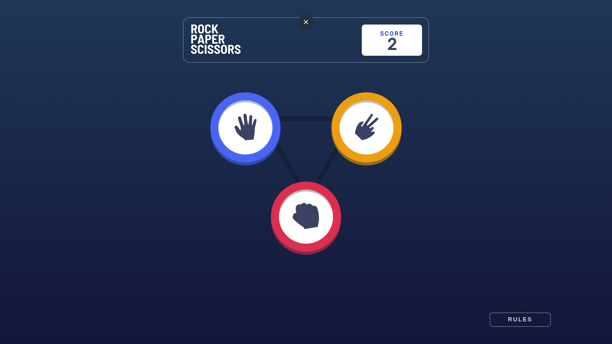

# Rock, Paper, Scissors Game

A simple web application for playing the classic game of Rock, Paper, Scissors built with React.



## Table of Contents

- [Features](#features)
- [Getting Started](#getting-started)
  - [Prerequisites](#prerequisites)
  - [Installation](#installation)
- [Usage](#usage)
- [Technologies](#technologies)

## Features

- **User-Friendly Interface:** A user-friendly and visually appealing game interface that allows players to easily select their choice (Rock, Paper, or Scissors) and view the game outcome.

- **Interactive Gameplay:** Engage in the timeless game of Rock, Paper, Scissors with interactive buttons and real-time feedback.

- **Score Tracking:** Keep track of the game score to see who's winning.

- **Responsive Design:** The game is designed to provide an optimal experience on various screen sizes and devices.

## Getting Started

### Prerequisites

To run this project, you need to have the following software installed on your machine:

- [Node.js](https://nodejs.org/) (with npm)

### Installation

1. Clone the repository :

   ```bash
   git clone https://github.com/your-username/rock-paper-scissors.git
   ```

2. Navigate to the project directory:
   ```bash
   cd rock-paper-scissors
   ```
3. Install dependencies:
   ```bash
   npm install
   ```

### Usage

1. Start the development server:

   ```bash
   npm start
   ```

2. Open your web browser and go to http://localhost:3000 to access the Rock, Paper, Scissors game.

3. Play the game by selecting your choice and see the result. The score will be updated accordingly.

### Technologies

- React (JavaScript library for building user interfaces)
- HTML/CSS (Markup and styling)
